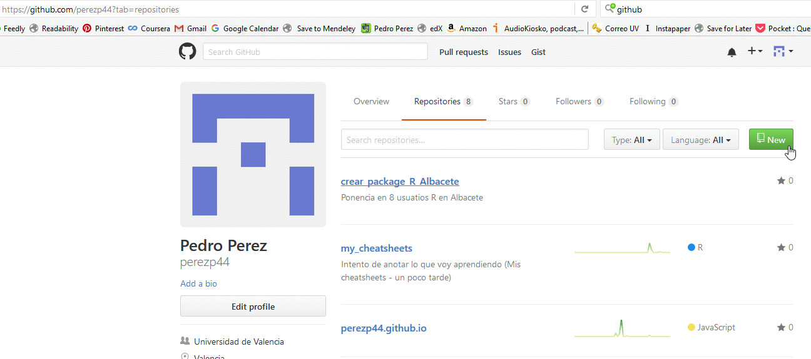

```{r setup, echo = F, include=FALSE}
knitr::opts_chunk$set(echo = TRUE, eval = F)
```


```{r, echo = F, message = F }
library(dplyr)
library(personal.pjp)
library(tidyr)
library(readr)
library(purrr)
library(ggplot2)
library(broom)

library(DT)
library(xtable)
library(pander)
library(knitr)
```

<br>

---------------------------


## Objetivo 

Crear un R package sencillo pero funcional que sirva para distribuir los materiales docentes de un curso en el que se usa R. El package se alojará en Github para facilitar su instalación.  

El package contendrá lo siguiente:

- 2 funciones (con su correspondiente documentación)  

- Una de las 2 funciones usará funciones de otro(s) package, así que habrá que importar esa función a nuestro package

- 2 ficheros de datos  

- Un archivo con documentación más extensa (vignette), donde se podrían incluir los scripts a usar en los ejercicios/prácticas de clase


Se hará de la forma más rápida y simple, que a mi juicio es usando un "Rproject de RStudio" y el package `devtools`. Gestionar todo en un `Rproject` facilita muchos las cosas, sobre todo cuando más adelante subamos nuestro package a Gitbub. `devtools` es un package desarrollado por Hadley Wickham que sirve para crear R packages, facilita mucho la tarea de crear y gestionar packages.


Es imposible en 20 minutos explicarlo todo, así que seré fundamentalmente práctico: me centraré en el proceso de creación. Es evidente que para entender muchos/todos los detalles y posibilidades en la creación de un package hay que leer algunas referencias. Al final de este tutorial daré referencias donde se explica con distinto nivel de detalle el proceso de creación de un R package.   

<br>

---------------------------


## Preparación del ordenador  

Para poder construir nuestro package necesitamos tener instalado lo siguiente:

- Obviamente R y RStudio  
- Los siguientes packages install.packages(c("devtools", "roxygen2", "knitr"))

Además, según tu sistema operativo necesitas (esto está fusilado de [este libro](http://r-pkgs.had.co.nz/)


* On Windows, download and install [Rtools](http://cran.r-project.org/bin/windows/Rtools/). 
  NB: this is not an R package!

* On Mac, make sure you have either XCode (available for free in the App Store)
  or the ["Command Line Tools for Xcode"](http://developer.apple.com/downloads).
  You'll need to have a (free) Apple ID.

* On Linux, make sure you've installed not only R, but also the R development
  tools. For example, on Ubuntu (and Debian) you need to install the 
  `r-base-dev` package.


Para chequear que tenéis Rtools instalado (si es que trabajáis en un PC con Windows) podéis hacerlo  con `has_devel()` así:


```{r, eval = F}
library(devtools)
has_devel()
#> '/Library/Frameworks/R.framework/Resources/bin/R' --vanilla CMD SHLIB foo.c 
#> 
#> clang -I/Library/Frameworks/R.framework/Resources/include -DNDEBUG 
#>   -I/usr/local/include -I/usr/local/include/freetype2 -I/opt/X11/include
#>   -fPIC  -Wall -mtune=core2 -g -O2  -c foo.c -o foo.o
#> clang -dynamiclib -Wl,-headerpad_max_install_names -undefined dynamic_lookup
#>   -single_module -multiply_defined suppress -L/usr/local/lib -o foo.so foo.o 
#>   -F/Library/Frameworks/R.framework/.. -framework R -Wl,-framework 
#>   -Wl,CoreFoundation
[1] TRUE
```


Si todo esta correcto recibiréis un mensaje de `[1] TRUE`

<br>

---------------------------


## Visión general de un package 


Podemos pensar que es un package es un conjunto de archivos dentro de una carpeta. Veamos la estructura típica de esa carpeta:


Tiene bastantes cosas, pero las que nos van a interesar principalmente son 3:


  - El fichero `DESCRIPTION`  
  - El fichero `NAMESPACE`
  - La carpeta `./R/`  (aquí están alojadas las funciones del package)
  
Cambien veremos pero no son necesarias:

  - La carpeta `./data/` (si queremos alojar datos irán aquí
  - La carpeta `./vignettes/` (si queremos una vignette)

También diremos algo de 

  - La carpeta `./man/`  (aquí estará alojada la documentación de las funciones de nuestro package pero se generará "automáticamente" con otro package: `roxygen`)

<br>

---------------------------

## Proceso de creación del pkg

Bueno, pues vamos allá:  a hacer el package, le pondré el nombre `pkg4albacete` y muchas veces me referiré a él como "nuestro package".

<br>

### 1^er^ paso: recopilando los elementos que meteré en el package

Lógicamente, supondremos que ya tenemos los elementos que nutrirán el package. En nuestro caso 2 ficheros de datos en formato `.rda`,  dos funciones (cada una en un fichero `.R`) 

### 2^o^ paso: Crear la estructura del package desde RStudio  

La estructura del package la crearemos con RStudio, concretamente con la siguiente sucesión de menus/opciones en RStudio:  `File > New Project > New Directory > Package > package name` que puedes ver en los gráficos de más abajo.


```{r, echo = F, eval = F}
#
#### Gif: Creando un package (gestionado como un Rproject) a través de RStudio
   #- asi se ponia el Gif

```

<br>


#####  Figures: Creando un package (gestionado como un Rproject) a través de RStudio
```{r, echo = F, eval = T}
library(png)
library(grid)
library(gridExtra)
img1 <-  rasterGrob(as.raster(readPNG("./imagenes/imagenes_gif/a1.png")), interpolate = FALSE)
img2 <-  rasterGrob(as.raster(readPNG("./imagenes/imagenes_gif/a2.png")), interpolate = FALSE)
img3 <-  rasterGrob(as.raster(readPNG("./imagenes/imagenes_gif/a3.png")), interpolate = FALSE)
img4 <-  rasterGrob(as.raster(readPNG("./imagenes/imagenes_gif/a4.png")), interpolate = FALSE)
#img5 <-  rasterGrob(as.raster(readPNG("./imagenes/imagenes_gif/a5.png")), interpolate = FALSE)
#img6 <-  rasterGrob(as.raster(readPNG("./imagenes/imagenes_gif/a6.png")), interpolate = FALSE)

grid.arrange( img1, img2, img3, img4,
  ncol = 2, nrow = 3, respect = T, padding = unit(0.5, "line"),as.table = T )
```


Si has seguido esta ruta de menús/opciones se habrá abierto en RStudio un archivo de una función que te dice `Hola`, pero también (y más importante) se habrá creado en tu PC (donde tú hayas seleccionado) una nueva carpeta que contendrá la estructura de nuestro package `pkg4albacete`
Ya he dicho que el nombre que he elegido para nuestro package es `pkg4albacete`. Podemos pensar que la carpeta donde está alojado `pkg4albacete` es `./pkg4albacete/`


<br>

El contenido inicial de la carpeta `my_package` es el siguiente:


<br>

Vamos a ir añadiendo elementos a `pkg4albacete`. Vamos a tener que modificar es lo siguiente:  

  - el archivo `NAMESPACE`  
  - el archivo `DESCRIPTION`  
  - la carpeta `./pkg4albacete/R/`  
  - la carpeta `./pkg4albacete/man/`  (esto lo hará `devtools`)
  
Después crearemos (también a través de `devtools`) las carpetas:

  - la carpeta `./pkg4albacete/data/`
  - la carpeta `./pkg4albacete/man/` 


### 3^er^ paso: Modificando el fichero `DESCRIPTION`  


El fichero `DESCRIPTION` , tal y como nos lo ha creado RStudio tiene ésta estructura:


```yaml  
Package: pkg4albacete
Type: Package
Title: What the Package Does (Title Case)
Version: 0.1.0
Author: Who wrote it
Maintainer: The package maintainer <yourself@somewhere.net>
Description: More about what it does (maybe more than one line)
    Use four spaces when indenting paragraphs within the Description.
License: What license is it under?
Encoding: UTF-8
LazyData: true
```


Lo vamos a modificar usando un editor de texto a algo como:


```yaml
Package: pkg4albacete
Type: Package
Date: 2016-10-10
Title: Package para el curso Econometría I de GECO
Version: 0.1.0
Author: Pedro J. Pérez <pjperez@uv.es>
Maintainer: Pedro J. Pérez <pjperez@uv.es>
Description: Este package se utiliza como apoyo docente al curso
    de Econometría de la Licenciatura de GECO en la UV
Imports:
    dplyr,
    magrittr
License: GPL-3
Encoding: UTF-8
LazyData: true
```

Si os fijáis, hay varios cambios: 

- He puesto mi nombre y e-mail en `Author:` y `Maintainer`  

- He añadido `Date:`  y `License:`  

- En `Title:` debe ir una sola linea con una breve descripción de qué hace el package. **Cuidado!**, no puede acabar con un punto   

- En `Description:` se puede poner una descripción más larga del package. **Fíjate** que si hay varias lineas, la segunda y siguientes lineas deben llevar una sangría de 4 espacios.   

Como `Description:` only gives you a small amount of space to describe what your package does, I also recommend including a `README.md` file that goes into much more depth and shows a few examples. Ya lo haremos al subir el package a Github.

- He añadido `Imports:`. Como tiene varias lineas, la segunda y siguiente tambien van con sangría  de 4 espacios


El campo más complicado de entender es `Imports:`. Este campo da la lista de R packages que "nuestro package" necesita para poder funcionar (puede que no necesite ninguno). En nuestro caso, una de las funciones que vamos a meter en pkg4albacete necesita funciones de 2 packages: `dplyr` y `magrittr`, así que hay que "importarlos", asegurarse de que están disponibles con `Import:`. 

Si tu package necesita una versión específica de otro package hazlo así:

```yaml
Imports:
    ggplot2 (>= 0.2),
    dplyr (>= 0.3.0.1)
```

Otra forma de añadir el campo `imports` es usando el package `devtools`, concretamente con la instrucción `devtools::use_package("pkg_name")`. Esto modifica automáticamente el campo imports en el fichero `DESCRIPTION`. Por ejemplo

```{r, eval = FALSE}
devtools::use_package("dplyr") 
#> Adding dplyr to Imports
#> Refer to functions with dplyr::fun()
```

<br>

### 4^o^ paso: Metiendo nuestros 2 ficheros de datos en  `./pkg4albacete/data/`

Tenemos 2 ficheros de datos `esp.rda` y `fra.rda `que queremos alojar en nuestro package. Los datos están en formato `.rda` y los podemos en este formato grabar así:

```{r, eval = F}
dir.create("./data")   #- creamos el directorio
save(my_data, file="./data/esp.RData") #- guardamos my_data en formato .RData o .rda
```


Para documentar los 2 ficheros de datos puedes crear un sólo fichero llamado `data.R` y alojarlo en la carpeta `./pkg4albacete/R/`. El archivo ha de ser algo como:

```yaml
#' 13 PIACC variables for SPAIN
#'
#' PIACC data for SPAIN. PIACC es el acrónimo de 
#' Programa para la Evaluación Internacional de las
#' Competencias de los adultos (PIAAC) de la OCDE. 
#' Información detallada sobre el programa PIAAC puede encontrarse en su página web
#' (http://www.oecd.org/skills/piaac/) 
#' The 13 variables here are as follows:
#'
#' @format A data frame with 1991 rows and 13 variables:
#' \itemize{
#'   \item CNTRYID: Country ID (ISO 3166, numeric)
#'   \item SEQID: Sequential ID (randomly derived)
#'   \item GENDER_R: Person resolved gender from BQ and QC check (derived)
#'   \item EARNHR: Hourly earnings excluding bonuses for wage and salary earners (derived)
#'   \item EARNMTH: Monthly earnings excluding bonuses for wage and salary earners (derived)
#'   \item D_Q16b: Current work - Earnings - Gross pay
#'   \item EDCAT7: Highest level of formal education obtained (7 categories - derived)
#'   \item YRSQUAL: Highest level of education obtained imputed into years of education (derived)
#'   \item C_Q09_C: Current status/work history - Years of paid work during lifetime (top-coded at 47)
#'   \item C_D05: Current status/work history - Employment status (DERIVED BY CAPI)
#'   \item J_Q02a: Background - Living with spouse or partner
#'   \item J_Q04a: Background - Born in country
#'   \item PVNUM1: Numeracy scale score - Plausible value 1
#' }
"esp"


#'#' 13 PIACC variables for FRANCE
#'
#' PIACC data for FRANCE. PIACC es el acrónimo de 
#' Programa para la Evaluación Internacional de las
#' Competencias de los adultos (PIAAC) de la OCDE. 
#' Información detallada sobre el programa PIAAC puede encontrarse en su página web
#' (http://www.oecd.org/skills/piaac/) 
#' The 13 variables here are as follows:
#'
#' @format A data frame with 3346 rows and 13 variables:
#' \itemize{
#'   \item CNTRYID: Country ID (ISO 3166, numeric)
#'   \item SEQID: Sequential ID (randomly derived)
#'   \item GENDER_R: Person resolved gender from BQ and QC check (derived)
#'   \item EARNHR: Hourly earnings excluding bonuses for wage and salary earners (derived)
#'   \item EARNMTH: Monthly earnings excluding bonuses for wage and salary earners (derived)
#'   \item D_Q16b: Current work - Earnings - Gross pay
#'   \item EDCAT7: Highest level of formal education obtained (7 categories - derived)
#'   \item YRSQUAL: Highest level of education obtained imputed into years of education (derived)
#'   \item C_Q09_C: Current status/work history - Years of paid work during lifetime (top-coded at 47)
#'   \item C_D05: Current status/work history - Employment status (DERIVED BY CAPI)
#'   \item J_Q02a: Background - Living with spouse or partner
#'   \item J_Q04a: Background - Born in country
#'   \item PVNUM1: Numeracy scale score - Plausible value 1
#' }
"fra"
```

Como ves hay un bloque de "Roxygen comments" (las lineas que empiezan con `#'`) para cada fichero de datos (esp y fra). Es parecido a documentar las funciones (que veremos luego), sólo que al final has de incluir una linea con el nombre del fichero de datos como character string, en nuestro caso `"esp"` y `"fra"`

El fichero de documentación no tiene porque ser tan largo, bastaría con (incluso con menos):


```yaml
#' 13 PIACC variables for SPAIN
#'
#' PIACC data for SPAIN. PIACC es el acrónimo de 
"esp"


#'#' 13 PIACC variables for FRANCE
#'
#' PIACC data for FRANCE. PIACC es el acrónimo de 
"fra"
```

Nosotros creamos ese fichero `./pkg4albacete/R/data.R` y más adelante haremos uso de `devtools` que es quien realmente pasará ese fichero a un formato parecido al latex.


Cuando pkg4albacete esté operativo y alguien se lo instale, podrá cargar y usar los datos que hemos cargado en el nuestro package con: 

```{r, eval = F}
esp <- data(esp)
```

Y se podrá ver la información que hemos proporcionado sobre los datos con `?esp`


<br>

### 5^o^ paso: Metiendo nuestras 2 funciones en `./pkg4albacete/R/`

Tenemos 2 funciones que queremos alojar en nuestro package. Cada función la tenemos escrita en un fichero `.R`. 

La primera función la tenemos en el fichero `my_fun_1.R`. Veámosla:

```yaml
my_fun_1 <- function(df, print = FALSE) {
    result <- df %>% summarise_each(. , funs(mean))
    return(result)
}
```
La función `my_fun_1()` tiene como argumento un data.frame y devuelve otro df con las medias de cada una de las columnas del df original. Para que `my_fun_1()` funcione necesita la función/operador `%>%` y la función `summarise_each()` que pertenecen a los packages `magritt` y `dplyr` respectivamente; por ello, para que `my_fun_1()` funcione necesita que "estén" `magritt` y `dplyr`, así que tendremos que "importarlos".  


La segunda función la tenemos en el fichero `my_fun_2.R`. Veámosla:

```yaml
my_fun_2 <- function(x, y) {
  result <- x + y
  return(result)
}
```

Esta segunda función es muy sencilla, metes dos números y te devuelve su suma. No necesita ninguna función, solo necesita `+` de R base. Para que funcione no necesitamos "importar" ningún package, porque siempre que abres RStudio se carga Rbase. 


Tenemos que meter estos 2 ficheros en la carpeta `./pkg4albacete/R/`. Veamos que hay ahora en `./pkg4albacete/R/`:


Vemos que hay un archivo llamado `hello.R`. Es una función de ejemplo/recordatorio que nos ha creado automáticamente RStudio cuando iniciamos nuestro package con el único objetivo de recordarnos que las funciones de nuestro package deben alojarse en el directorio `R`. Esta función la podemos borrar o dejar, yo la dejaría, siempre es bueno tener a alguien que te diga hola, aunque sea una función (si la borras también hay que borrar el fichero `hello.Rd` que está en la carpeta donde se guarda la documentación de las funciones `.(pkg4albacete/man/`  "man" se supone que viene de "manuals")
 
Así que podemos borrar el archivo `./pkg4albacete/R/hello.R` , pero lo que **SÍ** tenemos que hacer es alojar en la carpeta `./pkg4albacete/R/` los 2 archivos que contienen nuestras funciones. Ahora nos tocará documentar nuestras funciones (no es estrictamente necesario pero ...)
 

<br>

### 6^o^ paso: Documentando nuestras 2 funciones en `./pkg4albacete/R/`

Es el paso que más me costó entender. ¿Por qué? Pues porque la documentación se tiene que escribir en un formato especial.

Nosotros vamos a escribir la documentación de nuestras funciones con **roxygen comments**. Lo más llamativo de estos comments es que en lugar de comenzar con `#`  empiezan con `#'` pero tienen muchas pejigueras. Veamos algunas:


Por ejemplo, para nuestra función más sencilla `my_fun_2`  si le añadimos roxygen comments (se ponen antes de la función) quedaría como:

```yaml
#' Esta función suma 2 números
#'
#' @param x Un número
#' @param y Un número
#' @return La suma de \code{x} e \code{y}
#' @examples
#' my_fun_2(1, 1)
#' my_fun_2(10, 1)
#' @export

my_fun_2 <- function(x, y) {
  result <- x + y
  return(result)
} 

```

Fíjate que `@export` hará que `my_fun_2` se "exporte" y pueda ser usado por todo aquel que se instale nuestro package.

Fíjate que los parámetros `x e y` se referencian como `\code{x}`  y  `\code{y}`. Si quieres saber todo sobre cómo documentar tus funciones ve [aquí](http://r-pkgs.had.co.nz/man.html#roxygen-comments)


Una vez tenemos `my_fun_2.R` con sus roxygen comments al principio, tendremos que procesar este archivo con el package `roxygen`; concretamente si ejecutas en RStudio `devtools::document()` convertirá esos xorygen comments creando un nuevo archivo `.Rd`, en nuestro caso `my_fun_2.Rd` que estará alojado en `pkg4albacete/man/`. (Cuidado: has de ejecutar `devtools::document()` "desde" `pkg4albacete`)


Vamos a documentar `my_fun_1`:

```yaml
#' Esta función coge un df y calcula la media de cada columna
#'
#' @param df Un data.fram
#' @return Un nuevo df con la media de cada columna del df original \code{df} 
#' @examples
#' my_fun_1(mtcars)
#' @export

my_fun_1 <- function(df, print = FALSE) {
    result <- df %>% summarise_each(. , funs(mean))
    return(result)
} 

```


<br>

### 7^o^ paso: Modificando el fichero `NAMESPACE`  

Bueno, pues ya casi está, falta modificar el fichero `NAMESPACE`. Este fichero controla que funciones se exportaran y que funciones de otros packages se importan.

Si has ejecutado `devtools::document()` para generar la documentación de las funciones, entonces `devtools` ya ha modificado el fichero `NAMESPACE` para que nuestras 2 funciones se "exporten". `devotools` sabe que tiene que exportarlas porque se lo hemos dicho en la documentación de la función con `@export`; por lo tanto si has ejecutado `devtools::document()`, el fichero `NAMESPACE`  ya incluirá algo como:

```yaml
# Generated by roxygen2: do not edit by hand

export(my_fun_1)
export(my_fun_2)
```

Si no hubieses ejecutado `devtools::document()` aún, el fichero `NAMESPACE` estará como nos lo creo RStudio:

```yaml
exportPattern("^[[:alpha:]]+")
```

Venga, hazlo ya, a documentar tus funciones!!. Incluye `@export` y ejecuta `devtools::document()` para que NAMESPACE se ocupe de "exportar" tus funciones

Ahora nos falta "IMPORTAR" las funciones que nuestro package necesita. En nuestro caso, recordad que my_fun_1 necesitaba ` %>%` del package `magrittr` y `summarize_all()` de `dplyr` ; así que para que my_fun_1 corra hay que importarlas.


La "mejor" forma de hacerlo es: 

Primero recordar que ya tenemos medio trabajo hecho porque en la `DESCRIPTION` file pusimos lo siguiente:

```yaml
Imports:
    dplyr,
    magrittr
```

Esto nos aseguraba que quien cargase `pkg4albacete` también tendría en su PC dplyr y magittr. Es como si hubiesen hecho `install.packages(c("dplyr","magrittr"))`. ¿Qué nos falta? Pues `library()` ...

Nos falta "hacer library()" para cargar los paquetes dplyr y magrittr. Para ello tenemos 2 posibilidades: hacerlo con `::` o "importarlos explicitamente". Hadley recomienda la primera forma, pero aquí(para hacerlo más sencillo lo haremos de la segunda)


1) la primera forma (que es la que no vamos a utilizar): con `::`

Tendríamos que escribir my_fun_1 de esta forma (no muestro los roxygen comments que hay en la parte superior de la función)


```yaml
my_fun_1 <- function(df, print = FALSE) {
  result <- df   magrittr::%>%   dplyr::summarise_each(. , funs(mean))
  return(result)
}
```
Es decir, llamas a las funciones con `package::funcion` que en nuestro caso es: `magrittr::%>%`  y `dplyr::summarise_each`

2) La segunda forma: "importando" explicitamente las funciones en `NAMESPACE`. Esto se hace poniendo dos nuevas lineas en nuestro archivo `NAMESPACE`, **PERO** mejor que lo haga `devtools` por nosotros; así que aunque nuestro objetivo es modificar `NAMESPACE` lo que haremos es modificar nuestras funciones y luego llamar a devtools. Bueno, en nuestro caso solo nos hace falta modificar my_fun_1 que necesita 2 funciones de otros packages, porque my_fun_2 no necesita de otros packages.

Modificaremos `my_fun_1` para que quede como:

```yaml
#' Esta función coge un df y calcula la media de cada columna
#'
#' @param df Un data.fram
#' @return Un nuevo df con la media de cada columna del df original \code{df}
#' @examples
#' my_fun_1(mtcars)
#' @export
#' @import dplyr
#' @importFrom magrittr %>%

my_fun_1 <- function(df, print = FALSE) {
  result <- df %>% summarise_each(. , funs(mean))
  return(result)
}
```
Fíjate que le he añadido 2 lineas que empiezan por `@importFrom` y `@import`. Al final he decidido importar todo dplyr

Una vez hemos incluido en nuestras funciones lo que necesitamos importar sólo queda que `devtools` haga el trabajo sucio. ¿Cómo? pues otra vez con `devtools::document()`. Si ejecutamos esta instrucción, nuestro `NAMESPACE` quedará como:


```yaml
# Generated by roxygen2: do not edit by hand


export(my_fun_1)
export(my_fun_2)
import(dplyr)
importFrom(magrittr,"%>%")
```


<br>

### 8^o^ paso: Creando una vignette 


No hace falta crear una vignette, pero creo que es útil que si el package es para una asignatura, los estudiantes tengan a mano los scripts/materiales que se usan para solucionar/documentar algunas prácticas.


Las "vignettes" se pueden construir de varias maneras pero lo más fácil es que la estructura nos la cree devtools y luego nosotros ya añadiremos el contenido que queramos (lo escribiremos en formato Rmarkdow). Escribir en Rmarkdown es muy fácil pero necesita del package `knitr` y del programa `pandoc`. Afortunadamente cómo estamos creando pkg4albacete con RStudio ya los tenemos instalados.   


Para crear una vignette con devtools sólo hay que ejecutar `devtools::use_vignette("my-vignette")`. Con esta instrucción devtools habrá creado la carpeta `./pkg4albacete/vignettes`  y dentro el archivo `my-vignette.Rmd`
  
Fíjate que la extensión del archivo es  Rmarkdown `.Rmd` . Cuando alguien cargue pkg4albacete podrá ver las viñetas de pkg4albacete (de momento sólo hay una) con la instrucción `browseVignettes("pkg4albacete")`. Si queremos mostrar una viñeta concreta, lo podemos hacer con  `vignette(my-vignette)`. Si queremos ver el código de la viñeta lo podemos hacer con `edit(vignette(my-vignette))`


Lógicamente tendremos que modificar (escribiendo en formato Rmarkdow) `my-vignette` para que muestre lo que queramos explicar en clase, vamos los contenidos/ejercicios/scripts del curso. Esto es tarea vuestra.


**IMPORTANTE:** Una vez hayamos puesto en nuestra viñeta todo lo que queramos contar, falta "construirla" con la instrucción `devtools::build_vignettes()`


### 9^o^ paso: Construyendo (Building) pkg4albacete

Bueno, para mí el package ya esta construido: tengo dentro de la carpeta todo lo que necesito (funciones, documentación, datos, ...) pero realmente, aún no es un package operativo, sólo es un carpeta con una estructura concreta y ficheros. Falta "construirlo", pero eso es lo que hace siempre por nosotros `install.packages()`. 

En realidad es un poco más complicado ...

> it really helps to understand the five states a package can be in across its lifecycle: source, bundled, binary, installed and in-memory. (Hadley)


De momento podemos pensar que pkg4albacete está en estado "source":

> A source package is just a directory with components like R/, DESCRIPTION, and so on. (Hadley)

Y lo podemos hacer operativo con `install.packages()` pero como no está en CRAN, ni en Github (todavía), hay que cargarlo desde LOCAL con:


```{r, eval = F}
install.packages("C:/Users/perezp/Desktop/a_GIT_2016/pkg4albacete", repos = NULL, type="source")   
library(pkg4albacete)
```

Fíjate que has de poner la ruta de `pkg4albacete` en tu ordenador.


Espero que te haya funcionado. Si ha sido así, ya tienes cargado `pkg4albacete` y puedes usarlo, por ejemplo:


```{r, eval = F}
my_fun_2(4,6)           #- usamos my_fun_2() para sumar 2 números
my_fun_1(mtcars)        #- usamos my_fun_1() para calcular las medias de las columnas de mtcars
my_fun_1(esp)           #- usamos my_fun_1() para calcular las medias de las variables de esp
?esp                    #- obtenemos información sobre el df esp
?my_fun_2               #- obtenemos información sobre el df esp
browseVignettes("pkg4albacete")
vignette("my-vignette")     #- vemos la vignette "my-vignette"
```


## Alojando el pkg en Github  

Lo primero es crear un nuevo repo en tu cuenta en Github. Al repo lo llamaremos igual que nuestro package `pkg4albacete`. Obviamente, has de tener cuenta en Github.  

Una vez has creado el repo `pkg4albacete` en Github tenemos que "llenarlo" con todos los ficheros y carpetas que tenemos en `./pkg4albacete/`; para ello usaremos `Git Bash`:


0) En Github crear un repo que se llame igual que tu package. En nuestro caso `pkg4albacete`   
1) en Git Bash te situas en la carpeta del package. en mi caso con:   `cd c:/Users/perezp/Desktop/a_GIT_2016/pkg4albacete`      
2) Inicializas el repo vacio con :  `git init`   
3) Añades los archivos al repo: `git add .`    
4) Commit inicial: `git commit --all --message "Creando el REPO"`    
5) `git remote add origin https://github.com/perezp44/personal.pjp.git`     
6) `git push -u origin master`  


### Para instalar `pkg4albacete` desde Github

1)  devtools::install_github("perezp44/pkg4albacete"")   
2) library(pkg4albacete)


<br>
<br>
<br>

----------------------------

## Bibliografía

Yo aprendí a hacer un package mirando [este post de Hillary Parker](https://hilaryparker.com/2014/04/29/writing-an-r-package-from-scratch/). Es muy corto y preciso, pero claro, no es suficiente para entender.

Aun más minimalista es Martin Kosínski en su post [What Every R Package Must (REALLY) Contain?](https://www.r-bloggers.com/what-every-r-package-must-really-contain-an-example-on-the-erum2016-package/). Para hacer un package realmente sólo es necesario *"A DESCRIPTION file, and that’s it"*

Si quieres entenderlo "todo" necesitas [este libro de Hadley Wickham](http://r-pkgs.had.co.nz/)

Si quieres una cosa intermedia y que a mí me ayudo mucho mira lo de [Karl Broman](http://kbroman.org/pkg_primer/).

La biblia o documentación oficial está en [Writing R Extensions](https://cran.r-project.org/doc/manuals/r-release/R-exts.html) 


Mi recomendación. Leer primero à la Pérez, luego Hillary y luego Broman (Broman no usa devtools ni Rproject, así que a veces explica alguna cosa de forma diferente). Bromam lo explica muy bien todo. Si quieres profundizar en algo, necesitas a Hadley.


Good Luck!!!

